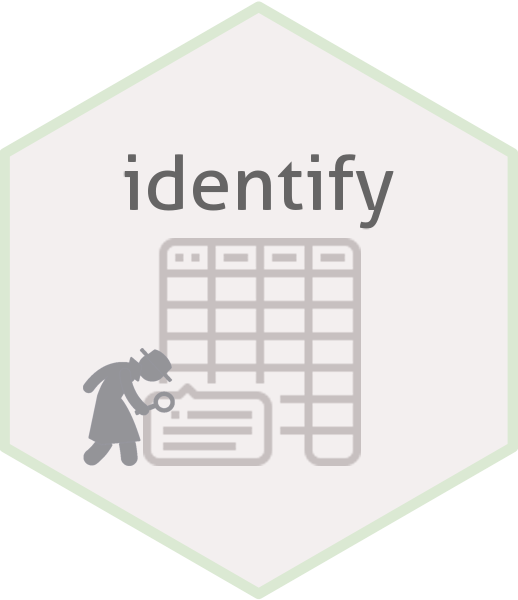

# identify 


# Overview

The identify package detects punctuation, space, empty, accent, and more, as a guide to treatment from data.

# Installation

You can install the released version of rpkg from [CRAN](https://CRAN.R-project.org) with:

``` r
# Wait.
```

Or install the development version of github:

```
remotes::install_github("brunofariadf/package/identify")
```

# Usage

This is a basic example that shows how to use a package function.

``` r
identify::str_class(mtcars)[,-c(2,4,5)]
#    column              head number letter accent punctuation space empty
# 1     mpg        21 21 22.8    yes     no     no         yes    no    no
# 2     cyl             6 6 4    yes     no     no          no    no    no
# 3    disp       160 160 108    yes     no     no         yes    no    no
# 4      hp        110 110 93    yes     no     no          no    no    no
# 5    drat      3.9 3.9 3.85    yes     no     no         yes    no    no
# 6      wt   2.62 2.875 2.32    yes     no     no         yes    no    no
# 7    qsec 16.46 17.02 18.6~    yes     no     no         yes    no    no
# 8      vs             0 0 1    yes     no     no          no    no    no
# 9      am             1 1 1    yes     no     no          no    no    no
# 10   gear             4 4 4    yes     no     no          no    no    no
# 11   carb             4 4 1    yes     no     no          no    no    no
```

``` r
identify::extract_punctuation(identify::stadium)
#     column     class              head       extract
# 1  country character Australia Austra~          \\'-
# 2     city character Melbourne Brisba~  ()-\\.&/<+>'
# 3     name character Marvel Stadium S~ ()-&\\'@.<+>,
# 4     club character Melbourne Victor~   ,-\\.'&<+>/
# 5 capacity character 56 347 53 223 45~          <NA>
```

# Code of Conduct

Please note that the project is released with a [Contributor Code of Conduct](https://contributor-covenant.org/version/2/0/CODE_OF_CONDUCT.html). By contributing to this project, you agree to abide by its terms.

# License

MIT